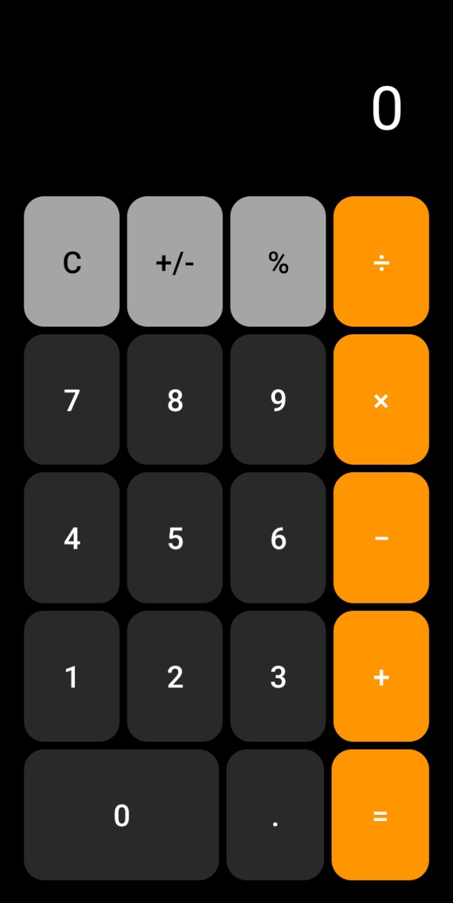

# Android Calculator App

A modern, user-friendly calculator app for Android devices, developed in Java using Android Studio. This app provides basic arithmetic operations, percentage calculations, and additional features with a sleek and intuitive UI.



## Features

- **Arithmetic Operations**: Perform addition, subtraction, multiplication, and division.
- **Percentage Calculation**: Calculate percentages with ease.
- **Sign Toggle**: Switch between positive and negative values.
- **Clear Display**: Reset the current input and calculations.
- **Responsive Design**: Adjusts seamlessly to different screen sizes.
- **Interactive UI**: Modern design inspired by standard calculator interfaces.

## Tech Stack

- **Language**: Java
- **IDE**: Android Studio
- **UI**: XML
- **Framework**: Android SDK

## Installation

Follow these steps to run the app on your local machine:

1. Clone the repository:
   ```bash
   git clone https://github.com/saqibb786/calculator.git
   ```

## Contributions

Feel free to fork the repository, submit a pull request, or open an issue if you find bugs or have suggestions for improvements.

## License

This project is licensed under the MIT License - see the [LICENSE](LICENSE) file for details.
